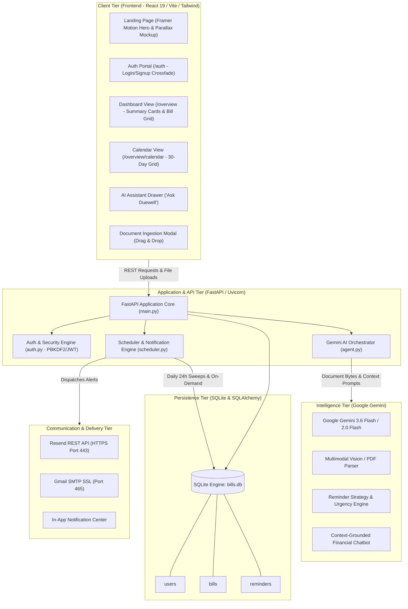
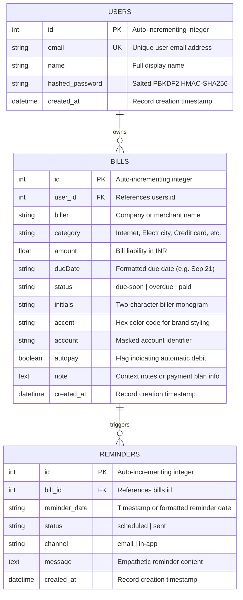
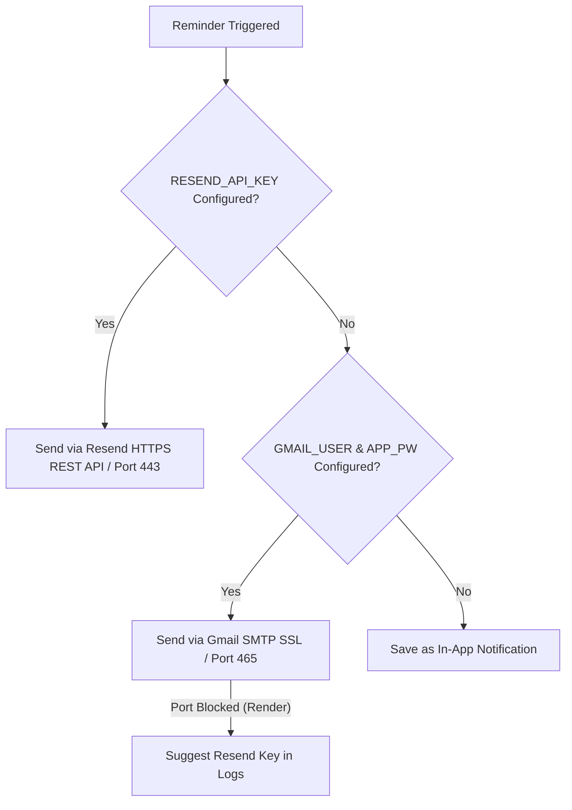
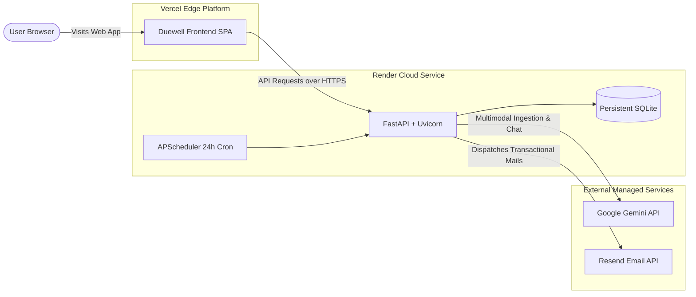

# Duewell (FLEXI) — Comprehensive System Documentation & Technical Report

**Duewell** is an intelligent, agentic bill payment reminder and personal financial companion designed to eliminate late fees, minimize cognitive fatigue, and bring calm predictability to personal cash flow management.

This document serves as the **master engineering handbook, onboarding guide, and technical project report**. It covers end-to-end system architecture, data models, AI/LLM orchestration, frontend and backend implementations, API contracts, deployment configurations, and local setup instructions.

---

## Table of Contents

1. [Executive Summary & Project Overview](#1-executive-summary--project-overview)
2. [Problem Statement & Solution Architecture](#2-problem-statement--solution-architecture)
3. [High-Level System Architecture](#3-high-level-system-architecture)
4. [Technology Stack](#4-technology-stack)
5. [Directory & Repository Structure](#5-directory--repository-structure)
6. [Data Models & Database Schema](#6-data-models--database-schema)
7. [AI & Multimodal Agent Intelligence (Gemini)](#7-ai--multimodal-agent-intelligence-gemini)
8. [Automated Notification & Scheduler Engine](#8-automated-notification--scheduler-engine)
9. [RESTful API Reference & Endpoint Specifications](#9-restful-api-reference--endpoint-specifications)
10. [Frontend Architecture, Design System & User Flows](#10-frontend-architecture-design-system--user-flows)
11. [Security, Authentication & Privacy](#11-security-authentication--privacy)
12. [Comprehensive Local Setup & Installation Guide](#12-comprehensive-local-setup--installation-guide)
13. [Environment Configuration Reference](#13-environment-configuration-reference)
14. [Cloud Deployment Architecture (Vercel + Render)](#14-cloud-deployment-architecture-vercel--render)
15. [Verification, Diagnostics & Troubleshooting](#15-verification-diagnostics--troubleshooting)
16. [Future Roadmap & Project Extensions](#16-future-roadmap--project-extensions)

---

## 1. Executive Summary & Project Overview

### 1.1 Brand Identity & Concept
- **Product Name:** Duewell (Codebase identifier: `FLEXI`)
- **Tagline:** *"Less mental load. More room to live."*
- **Positioning:** A calm, premium financial companion that automatically discovers, extracts, organizes, and reminds users of upcoming commitments.

### 1.2 Core Capabilities
1. **Multimodal Document Understanding:** Users can drop invoices, utility bills, or credit card PDFs/images. Google Gemini (`gemini-3.6-flash`) extracts biller names, total amounts, due dates, categories, and account numbers in structured JSON.
2. **Autonomous Urgency & Reminder Scheduling:** Dynamic calculation of reminder timing based on days remaining, bill magnitude, and status (overdue vs. due-soon), with tone-calibrated reminder copy.
3. **Dual Delivery Engine:** Intelligent routing through Resend HTTPS API (REST port 443 for cloud environments like Render Free Tier) with automatic fallback to SSL Gmail SMTP (port 465) and In-App notification feeds.
4. **Conversational Financial Copilot ("Ask Duewell"):** Context-aware AI assistant grounded on live user database records, capable of answering queries regarding total cash flow liabilities, weekly deadlines, and historical payments.
5. **Calm UI/UX Design System:** Soft cream backgrounds (`#F7F5F0`), editorial serif headlines (Fraunces), clean sans-serif UI typography (Inter), gentle pastel status pills, and fluid Framer Motion micro-interactions.

---

## 2. Problem Statement & Solution Architecture

### 2.1 The Problem
- **Fragmentation:** Modern recurring bills arrive across disparate channels: email inboxes, paper mail, SMS alerts, utility portals, and credit card applications.
- **Cognitive Load & Late Fees:** Traditional calendar alerts are static and disconnected from payment records. Users forget to set reminders or dismiss generic alarms, resulting in missed due dates, interest penalties, and damaged credit ratings.
- **Cluttered FinTech Interfaces:** Most expense managers are noisy, cluttered with advertisements, overly complex budgeting charts, or intrusive investment upsells that create anxiety rather than clarity.

### 2.2 The Duewell Solution
- **Zero-Friction Ingestion:** Manual entry takes seconds; file drag-and-drop takes zero typing.
- **Context-Aware Urgency:** High-value or overdue bills receive escalating priority, whereas routine recurring bills receive gentle, non-intrusive pings.
- **Complete Visibility:** Single-pane dashboard offering balance summaries, category breakdowns, a dedicated payment calendar, and searchable timeline views.

---

## 3. High-Level System Architecture



### 3.1 Data Flow Diagrams

#### A. Document Upload & Multimodal Extraction Flow
1. User drops a PDF or PNG/JPG receipt into the `AddBillModal` in the frontend.
2. Frontend sends `multipart/form-data` to `POST /bills/upload`.
3. FastAPI forwards file bytes to `agent.extract_bill_from_document()`.
4. Gemini multimodal engine parses text, numbers, dates, and layouts, returning structured JSON:
   `{ biller, amount, dueDate, category, account, note }`.
5. Frontend auto-populates input fields allowing the user to review and confirm before committing to the SQLite database via `POST /bills`.

#### B. Intelligent Reminder Dispatch Flow
1. Either user triggers an on-demand reminder (`POST /bills/{id}/trigger-reminder`) or APScheduler's daily sweep scans active unpaid bills.
2. `agent.decide_reminder_schedule()` evaluates bill status, due date, and amount to assign urgency (`low`, `medium`, `high`) and compose an empathetic reminder message.
3. `scheduler.send_notification()` inspects available credentials:
   - **Primary:** Resend HTTP API (`https://api.resend.com/emails`) with branded HTML email template.
   - **Secondary:** Gmail SMTP SSL (`smtp.gmail.com:465`).
   - **Fallback:** In-App Notification record stored in the database.
4. Reminder event is logged to the `reminders` table and displayed in the frontend notification bell badge.

---

## 4. Technology Stack

### 4.1 Frontend
| Technology | Version | Purpose |
| :--- | :--- | :--- |
| **React** | `^19.2.1` | Modern declarative UI component library |
| **TypeScript** | `5.6.3` | Type-safety, strict data models, and refactoring resilience |
| **Vite** | `^7.1.7` | Blazing-fast HMR and optimized asset bundling |
| **Tailwind CSS** | `^4.1.14` | Utility-first styling with custom theme tokens |
| **Framer Motion** | `^12.23.22` | Declarative page transitions, scroll-driven parallax, and drawer animations |
| **Lucide React** | `^0.453.0` | Minimalist, clean iconography throughout the UI |
| **Sonner** | `^2.0.7` | Rich, non-blocking toast notifications |
| **Radix UI** | Latest | Accessible unstyled primitives (Dialog, Tabs, Tooltip, Avatar, Dropdown) |
| **React Router** | `^7.18.4` | Client-side routing (`/`, `/auth`, `/overview`, `/overview/bills`, `/overview/calendar`) |

### 4.2 Backend
| Technology | Version | Purpose |
| :--- | :--- | :--- |
| **Python** | `3.10+` | Core programming language |
| **FastAPI** | `>=0.110.0` | High-performance asynchronous REST API framework |
| **Uvicorn** | `>=0.28.0` | Lightning-fast ASGI web server |
| **SQLAlchemy** | `>=2.0.0` | Relational ORM mapping Python classes to database schemas |
| **Pydantic** | `>=2.0.0` | Request payload validation and serialization schemas |
| **APScheduler** | `>=3.10.4` | In-process background job scheduler for daily reminder sweeps |
| **PyJWT** | `>=2.8.0` | RFC 7519 JSON Web Token issuance and validation |
| **Passlib / Cryptography** | `>=1.7.4` | Secure credential hashing (Salted PBKDF2 HMAC-SHA256) |
| **python-multipart** | `>=0.0.9` | Multipart file upload parsing for documents and receipts |
| **python-dotenv** | `>=1.0.0` | Environment variable isolation |

### 4.3 AI & External Integrations
| Service | Model / Protocol | Purpose |
| :--- | :--- | :--- |
| **Google Generative AI** | `gemini-3.6-flash` | Multimodal invoice parsing, reminder policy, and conversational QA |
| **Resend** | REST API (Port 443) | Reliable transactional email delivery bypassing cloud port blocks |
| **Gmail SMTP** | SSL Port 465 | Alternative direct SMTP provider for local and dedicated deployments |
| **SQLite** | Serverless DB | Zero-configuration local database engine (`bills.db`) |

---

## 5. Directory & Repository Structure

```
FLEXI/
├── ONBOARDING.md                      # Master Technical Documentation & Report (This file)
├── LANDING_AUTH_PLAN.md               # Architectural specification for public pages & auth
├── UI.txt                             # Design system guidelines, token specs & motion rules
├── .gitignore                         # Root Git ignore definitions
│
├── backend/                           # FastAPI Application Core
│   ├── main.py                        # API routes, CORS policies, lifespan handlers, DB seeding
│   ├── models.py                      # SQLAlchemy ORM schemas (User, Bill, Reminder)
│   ├── database.py                    # Database connection pool and SessionLocal generator
│   ├── auth.py                        # PBKDF2-HMAC password hashing and JWT token handlers
│   ├── agent.py                       # Google Gemini multimodal OCR, logic & chat engine
│   ├── scheduler.py                   # APScheduler setup, Resend HTTPS API, Gmail SMTP dispatcher
│   ├── requirements.txt               # Pinned Python package dependencies
│   ├── .env                           # Local secret variables (ignored by Git)
│   ├── .env.example                   # Annotated template of required environment keys
│   └── bills.db                       # Active SQLite database file
│
└── frontend/                          # Client Web Application
    ├── package.json                   # NPM dependencies, scripts, and package metadata
    ├── vite.config.ts                 # Vite bundler configuration with path aliases
    ├── tsconfig.json                  # TypeScript compiler settings
    ├── vercel.json                    # Vercel deployment rewrites and headers
    ├── .env.example                   # Sample frontend API configuration
    │
    └── client/
        └── src/
            ├── App.tsx                # Main application shell, routes, state & dashboard views
            ├── main.tsx               # Client bootstrap entry point
            ├── index.css              # Global styles, Tailwind directives & CSS variables
            ├── const.ts               # Shared constants & helper routines
            │
            ├── components/            # Reusable UI Components
            │   ├── DuewellLogo.tsx    # Branded SVG mark and typography lockup
            │   ├── ErrorBoundary.tsx  # React error boundary component
            │   ├── landing/           # Landing page sub-components
            │   │   ├── Navbar.tsx     # Public navigation bar with sign-in/get-started links
            │   │   ├── Hero.tsx       # Serif headline, drifting gradient blobs & CTAs
            │   │   ├── ProductPreview.tsx # Scroll-linked 3D parallax mockup
            │   │   └── FeatureGrid.tsx # Staggered feature cards on scroll
            │   └── ui/                # UI primitives (buttons, modals, dialogs, badges)
            │
            ├── contexts/              # Global state management
            │   └── ThemeContext.tsx   # Light / Dark theme toggle and localStorage sync
            │
            ├── hooks/                 # Custom React hooks (useScroll, useTheme, etc.)
            └── pages/                 # Full-page routes
                ├── LandingPage.tsx    # High-converting marketing & feature discovery page
                ├── AuthPage.tsx       # Unified Login/Signup page with AnimatePresence
                ├── Home.tsx           # Fallback home redirection page
                └── NotFound.tsx       # 404 handler
```

---

## 6. Data Models & Database Schema

The persistence layer uses SQLite with SQLAlchemy ORM. Foreign key constraints and cascading deletes maintain relational integrity.



### 6.1 Database Seeding
On cold application start, `main.py` seeds initial records if the database is empty:
- **Demo User:** `alex@example.com` (Password: `password123`, Name: `Alex Shah`).
- **Default Bills:**
  1. *Airtel Broadband* (Internet, ₹1,299, Due Sep 21, Status: `due-soon`, Autopay: `false`)
  2. *HDFC Bank* (Credit card, ₹18,420, Due Sep 18, Status: `overdue`, Autopay: `false`)
  3. *MSEDCL* (Electricity, ₹2,430, Due Sep 24, Status: `due-soon`, Autopay: `true`)
  4. *Netflix* (Subscriptions, ₹649, Due Sep 27, Status: `due-soon`, Autopay: `true`)
  5. *LIC Premium* (Insurance, ₹5,600, Due Oct 04, Status: `paid`, Autopay: `false`)
  6. *Pune Municipal* (Property tax, ₹3,200, Due Oct 09, Status: `paid`, Autopay: `false`)

---

## 7. AI & Multimodal Agent Intelligence (Gemini)

The AI layer in `backend/agent.py` leverages Google's Generative AI Python SDK (`google-generativeai`).

### 7.1 Multi-Modal Document Extraction (`extract_bill_from_document`)
Accepts raw byte arrays from PDFs, PNGs, and JPEGs. The Gemini model parses tabular structures, line items, and invoice numbers, returning strictly formatted JSON:

```json
{
  "biller": "Airtel Broadband",
  "amount": 1299.0,
  "dueDate": "Sep 28",
  "category": "Internet",
  "account": "•••• 4820",
  "note": "Fiber Ultra plan renewal"
}
```

*Resilience:* If the Gemini API key is unset or rate-limited, an offline heuristic parser safely provides sensible mock defaults to ensure the UI flow never crashes.

### 7.2 Dynamic Reminder Scheduling (`decide_reminder_schedule`)
Given bill details, Gemini calculates optimal reminder timing and generates an empathetic, calm reminder message:
- **Overdue bills:** High urgency, encouraging action today to prevent late penalties.
- **Due-soon bills:** Balanced tone, reassuring the user that Duewell is tracking the deadline.
- **Fallback Logic:** A deterministic engine applies status- and amount-based rules (`amount > 10,000` or `status == "overdue"` -> High urgency).

### 7.3 Conversational Financial Copilot (`answer_query`)
The `/chat` endpoint feeds live database summaries into the prompt context:
```
Total unpaid: ₹22,149, Total paid: ₹8,800.
Bills list:
- Airtel Broadband: ₹1299 (Internet), Due: Sep 21, Status: due-soon
- HDFC Bank: ₹18420 (Credit card), Due: Sep 18, Status: overdue
...
```
Gemini answers queries like *"What is my biggest expense this week?"* or *"How much do I owe on credit cards?"* in 1 to 3 concise, calm paragraphs.

---

## 8. Automated Notification & Scheduler Engine

Implemented in `backend/scheduler.py` using `APScheduler.schedulers.background.BackgroundScheduler`.

### 8.1 Dual Email Delivery Architecture


1. **Resend REST API (HTTPS Port 443):**
   - Ideal for cloud environments (Render Free Tier, Heroku, AWS Lambda) where outbound raw TCP ports 25, 465, and 587 are blocked by default.
   - Dispatches responsive, beautifully styled HTML emails with brand styling.
2. **Gmail SMTP SSL (Port 465):**
   - Supported for local development and self-hosted VPS environments. Requires a 16-character Google App Password with 2FA enabled.
3. **Safety Redirection:**
   - If a recipient is set to the default mock address (`alex@example.com`), the engine automatically redirects the notification to the active admin email (`RESEND_TO` or `GMAIL_USER`) so developers can verify live deliveries.

### 8.2 Scheduled Background Sweep
- The background job runs every 24 hours (`daily_reminder_sweep`).
- Queries all unpaid bills (`status != "paid"`).
- Verifies that no reminder was already sent on the current date, preventing duplicate notifications.

---

## 9. RESTful API Reference & Endpoint Specifications

All endpoints are hosted at `http://localhost:8000` (or the configured cloud URL) with automatic OpenAPI documentation at `/docs` and ReDoc at `/redoc`.

All protected endpoints require the HTTP Authorization header:
```http
Authorization: Bearer <JWT_ACCESS_TOKEN>
```
If the header is missing, invalid, or expired, the API returns `401 Unauthorized`.

---

### 9.1 Public & Diagnostic Endpoints

#### `GET /`
- **Auth:** Public (None)
- **Description:** Root liveness and capability probe.
- **Response (200 OK):**
  ```json
  {
    "app": "Duewell Bill Reminder System",
    "status": "online",
    "docs": "/docs",
    "agent": "gemini-3.6-flash"
  }
  ```

#### `GET /health`
- **Auth:** Public (None)
- **Description:** Liveness check returning current UTC timestamp.
- **Response (200 OK):**
  ```json
  {
    "status": "ok",
    "timestamp": "2026-09-21T16:45:00.000000"
  }
  ```

#### `GET /mail-status`
- **Auth:** Admin Only (`require_admin`)
- **Headers:** `Authorization: Bearer <ADMIN_JWT>`
- **Description:** Reports status of configured email dispatchers (Resend API vs Gmail SMTP). Non-admin users receive `403 Forbidden`.
- **Response (200 OK):**
  ```json
  {
    "active_provider": "resend (HTTPS port 443 - Recommended for Render)",
    "resend": { "configured": true, "status": "ready" },
    "gmail_smtp": { "configured": false, "note": "Blocked on Render free tier" },
    "instructions": "Get free API key at resend.com..."
  }
  ```

#### `POST /test-mail?to=recipient@example.com`
- **Auth:** Admin Only (`require_admin`)
- **Headers:** `Authorization: Bearer <ADMIN_JWT>`
- **Query Params:** `to` (Optional string, defaults to configured `GMAIL_USER`)
- **Description:** Dispatches a live test email to verify transactional delivery. Returns `403 Forbidden` if invoked by non-admin accounts.
- **Response (200 OK):**
  ```json
  {
    "channel": "email",
    "status": "sent",
    "recipient": "recipient@example.com",
    "provider": "resend"
  }
  ```

---

### 9.2 Authentication Endpoints

#### `POST /auth/signup`
- **Auth:** Public
- **Request Body:**
  ```json
  {
    "email": "user@example.com",
    "password": "securepassword",
    "name": "Jane Doe"
  }
  ```
- **Response (200 OK):**
  ```json
  {
    "token": "eyJhbGciOiJIUzI1NiIsInR5cCI6IkpXVCJ9...",
    "user": {
      "id": 4,
      "email": "user@example.com",
      "name": "Jane Doe"
    }
  }
  ```
- **Errors:** `400 Bad Request` if email is already registered.

#### `POST /auth/login`
- **Auth:** Public
- **Request Body:**
  ```json
  {
    "email": "user@example.com",
    "password": "securepassword"
  }
  ```
- **Response (200 OK):** Returns JWT token and authenticated user payload.
- **Errors:** `401 Unauthorized` for invalid email or password.

#### `GET /auth/me`
- **Auth:** Authenticated User (`get_current_user`)
- **Headers:** `Authorization: Bearer <JWT>`
- **Description:** Validates stored token and returns the current user profile.
- **Response (200 OK):**
  ```json
  {
    "id": 4,
    "email": "user@example.com",
    "name": "Jane Doe"
  }
  ```
- **Errors:** `401 Unauthorized` if token is missing, expired, or invalid.

---

### 9.3 Bill Management Endpoints (User-Scoped)

#### `GET /bills`
- **Auth:** Authenticated User (`get_current_user`)
- **Headers:** `Authorization: Bearer <JWT>`
- **Description:** Retrieves all bills owned by the authenticated user (`bills.user_id == current_user.id`), ordered by ID descending.
- **Response (200 OK):** Array of bill objects. Empty array `[]` for fresh accounts.

#### `POST /bills`
- **Auth:** Authenticated User (`get_current_user`)
- **Headers:** `Authorization: Bearer <JWT>`
- **Request Body:**
  ```json
  {
    "biller": "Airtel Fiber",
    "category": "Internet",
    "amount": 1299.0,
    "dueDate": "Oct 15",
    "status": "due-soon",
    "account": "•••• 4820",
    "autopay": false,
    "note": "Plan renews monthly"
  }
  ```
- **Response (201 Created):** Created bill object with `id`, `user_id`, and `initials`.

#### `GET /bills/{bill_id}`
- **Auth:** Authenticated User (`get_current_user`)
- **Headers:** `Authorization: Bearer <JWT>`
- **Description:** Retrieves bill by ID.
- **Response (200 OK):** Bill object.
- **Errors:** `404 Not Found` if bill does not exist **or** belongs to another user.

#### `PATCH /bills/{bill_id}`
- **Auth:** Authenticated User (`get_current_user`)
- **Headers:** `Authorization: Bearer <JWT>`
- **Request Body:** Any partial subset of bill fields (e.g. `{"status": "paid"}`).
- **Response (200 OK):** Updated bill object.
- **Errors:** `404 Not Found` if bill belongs to another user.

#### `DELETE /bills/{bill_id}`
- **Auth:** Authenticated User (`get_current_user`)
- **Headers:** `Authorization: Bearer <JWT>`
- **Description:** Permanently deletes the bill and cascades to any reminder logs.
- **Response (200 OK):** `{"success": true, "message": "Bill deleted successfully"}`.
- **Errors:** `404 Not Found` if bill belongs to another user.

---

### 9.4 AI, Ingestion & Reminder Endpoints

#### `POST /bills/upload`
- **Auth:** Authenticated User (`get_current_user`)
- **Headers:** `Authorization: Bearer <JWT>`, `Content-Type: multipart/form-data`
- **Body:** `file` (Binary image/PDF invoice)
- **Description:** Parses document with Gemini Multimodal Flash, extracting structured bill details.
- **Response (200 OK):**
  ```json
  {
    "success": true,
    "data": {
      "biller": "Tata Power",
      "amount": 3410.0,
      "dueDate": "Oct 18",
      "category": "Electricity",
      "account": "•••• 6712",
      "note": "Residential tariff"
    }
  }
  ```

#### `POST /bills/{bill_id}/trigger-reminder`
- **Auth:** Authenticated User (`get_current_user`)
- **Headers:** `Authorization: Bearer <JWT>`
- **Query Params:** `recipient_email` (Optional string, defaults to `current_user.email`)
- **Description:** Analyzes bill urgency, generates tailored reminder copy, dispatches email (Resend/Gmail), and saves a reminder log entry.
- **Response (200 OK):**
  ```json
  {
    "success": true,
    "message": "Email sent!",
    "channel": "email",
    "recipient": "user@example.com",
    "reminder": {
      "id": 12,
      "bill_id": 5,
      "reminder_date": "2026-09-22 09:00:00",
      "status": "sent",
      "channel": "email",
      "message": "Airtel Fiber of ₹1,299 is due in 3 days."
    }
  }
  ```
- **Errors:** `404 Not Found` if bill belongs to another user.

#### `GET /reminders`
- **Auth:** Authenticated User (`get_current_user`)
- **Headers:** `Authorization: Bearer <JWT>`
- **Description:** Retrieves the 20 most recent reminders belonging to bills owned by the authenticated user (`Bill.user_id == current_user.id`).
- **Response (200 OK):** Array of reminder log objects.

#### `POST /chat`
- **Auth:** Authenticated User (`get_current_user`)
- **Headers:** `Authorization: Bearer <JWT>`
- **Request Body:** `{ "message": "What bills are due this week?" }`
- **Description:** Generates conversational financial advice grounded strictly in the authenticated user's bills (other users' data is never provided in context).
- **Response (200 OK):**
  ```json
  {
    "reply": "You have 2 bills due this week totaling ₹3,729..."
  }
  ```

---

## 10. Frontend Architecture, Design System & User Flows

### 10.1 Visual Design Tokens
- **Background:** Warm off-white / stone cream (`#F7F5F0`).
- **Cards & Surfaces:** Pure white (`#FFFFFF`), subtle soft border (`border-gray-200`), rounded 16px to 24px (`rounded-2xl`), minimal flat elevation.
- **Brand Accent:** Indigo / Violet-Blue (`#4F46E5` – `#5B5FEF`).
- **Typography:**
  - *Headlines:* Warm editorial serif (Fraunces style) with tight letter-spacing.
  - *Body / UI:* Clean modern sans-serif (Inter style).
- **Status Pills:** Light pastel background with darker high-contrast text:
  - `Overdue`: Soft coral/red badge (`bg-red-50 text-red-700`).
  - `Due soon`: Soft amber badge (`bg-amber-50 text-amber-700`).
  - `Paid`: Soft emerald/green badge (`bg-green-50 text-green-700`).

### 10.2 Page Routes & Key Components

#### 1. Landing Page (`/`)
- **Hero:** Big serif headline *"Never miss a bill again"*, subtitle, primary CTA *"Get started free"*, and secondary CTA *"Sign in"*.
- **Ambient Light Blobs:** Continuous subtle background drift powered by Framer Motion with `prefers-reduced-motion` safety checks.
- **Scroll-Linked 3D Product Mockup:** Uses Framer Motion's `useScroll` and `useTransform` to elevate and scale the dashboard preview as the user scrolls down.
- **Staggered Features Grid:** Three core capability cards (*Smart Reminders*, *Ask Duewell AI*, *Unified View*) animating into view via `whileInView` staggered variants.

#### 2. Authentication Portal (`/auth`)
- Single unified card supporting smooth crossfades between **Log in** and **Sign up** via `AnimatePresence`.
- Form validation with subtle shake feedback on error.
- Automatic session saving to `localStorage` (`duewell_token` and `duewell_user`).

#### 3. Dashboard Shell (`/overview`)
- **Metric Cards:**
  - *Outstanding Balance:* Formatted currency total with micro sparkline chart.
  - *Due This Week:* Count of upcoming bills with contextual next-bill label.
  - *Needs Attention:* Overdue counter highlighted in soft coral.
- **Interactive Bill Grid:** Quick filters (*All*, *Due soon*, *Overdue*, *Paid*), search bar with `⌘K` keyboard shortcut support, and instant *"Mark as paid"* action button.
- **Interactive Profile Dropdown & Sign Out:**
  - Header displays a dynamic circular avatar (`avatar-lg`) displaying the authenticated user's uppercase initials (e.g., `"JD"` for Jane Doe), dynamically derived from `user.name` with graceful fallback (`"U"`).
  - Clicking the profile avatar reveals a dropdown card showing:
    - User's full name
    - User's verified email address
    - A distinct **"Sign out"** action button featuring a log-out icon, which invokes `logout()` in `AuthContext`, clears local session tokens, and navigates immediately to `/auth`.
- **Interactive Branded Header Logo:**
  - The top-left Duewell logo and brand title are rendered as an interactive router link directing to `/overview` (or `/` when unauthenticated), providing an intuitive home navigation experience.
- **Slide-Over Detail Drawer:** Displays account numbers, full billing notes, cycle timeline, and *"Trigger on-demand reminder"* button.
- **Document Upload Modal:** Dual-tab modal supporting manual form entry and AI drag-and-drop document upload with animated scanning indicators.
- **"Ask Duewell" Copilot Drawer:** Conversational sidebar with suggested prompts (*"What’s due this week?"*, *"Payment summary"*).
- **Payment Calendar (`/overview/calendar`):** 30-day interactive calendar mapping bill due dates with brand accent badges and a 14-day upcoming agenda.

---

## 11. Security, Authentication & Multi-Tenant Privacy

### 11.1 Cryptographic Password Protection
- Passwords are never stored in plaintext.
- Passwords are hashed using salted HMAC-SHA256 PBKDF2 with 100,000 hash iterations (`auth.py`), mitigating rainbow table and brute-force GPU attacks.
- Constant-time string comparison prevents timing side-channel attacks during password verification.

### 11.2 Stateless JSON Web Tokens (JWT) Architecture
- **Algorithm:** Standard `HS256` signed using a cryptographically secure `JWT_SECRET`.
- **Payload Claims:**
  ```json
  {
    "user_id": 4,
    "email": "user@example.com",
    "exp": 1726963200
  }
  ```
- **Token Validity:** Configurable expiration window defaulting to 7 days (`ACCESS_TOKEN_EXPIRE_MINUTES = 60 * 24 * 7`).
- **Signature Verification:** Incoming requests decode the token, check token expiration, and verify integrity against `JWT_SECRET`.

### 11.3 Client-Side Token Storage & React AuthContext
- **Storage:** Persisted in browser `localStorage` under `duewell_token` (raw JWT string) and `duewell_user` (JSON user profile).
- **Centralized Context (`AuthContext.tsx`):** Exposes `{ user, token, login, signup, logout, isLoading }` through the `useAuth()` hook.
- **Session Rehydration:** Upon page reload, the client hydrates state from `localStorage` and immediately queries `GET /auth/me` with `Authorization: Bearer <token>`. If the token is invalid or expired, session state is cleared and the user is redirected to `/auth`.
- **Authenticated Fetch Requests:** All outgoing API calls attach the `Authorization: Bearer ${token}` header automatically.

### 11.4 Strict Multi-Tenant Isolation Model
- **Database Schema Isolation:** The `bills` table contains a foreign key `user_id` referencing `users.id`.
- **Query Scoping:** Every database query in `main.py` explicitly filters by `models.Bill.user_id == current_user.id`.
- **Cross-Tenant ID Enumeration Protection:** If User A attempts to view (`GET`), edit (`PATCH`), or delete (`DELETE`) a bill ID belonging to User B, the backend returns `404 Not Found` rather than `403 Forbidden`. This prevents malicious actors from discovering the existence or validity of other users' bill IDs.
- **AI Agent Context Isolation:** The `POST /chat` endpoint only supplies the current user's bills to the Gemini context window. No cross-user bill data can ever be leaked into AI responses.
- **Reminder Scoping:** The `GET /reminders` endpoint joins `reminders` with `bills` and filters strictly by `bills.user_id == current_user.id`.

### 11.5 Role-Based Access Control (RBAC) & Administrative Endpoints
- **Admin Configuration:** The environment variable `ADMIN_EMAIL` designates the authorized administrator email.
- **`require_admin` Dependency:** Wraps `get_current_user` and enforces `current_user.email == ADMIN_EMAIL`.
- **Protected Diagnostics:** Administrative actions such as `GET /mail-status` and `POST /test-mail` return `403 Forbidden` for standard authenticated users.
- **Safe Default:** If `ADMIN_EMAIL` is unset or blank, all administrative endpoints reject requests by default.

### 11.6 Acceptance Test Suite (`tests/test_auth.py`)
Duewell includes an automated acceptance test suite in `backend/tests/test_auth.py` verifying all 7 security acceptance criteria:
1. `test_signup_shows_real_name_and_empty_bills`: Fresh account starts with 0 bills and displays user's real name.
2. `test_two_users_see_only_their_own_bills`: Complete data isolation between distinct user sessions.
3. `test_no_token_returns_401_on_protected_routes`: Unauthenticated requests to protected endpoints return `401 Unauthorized`.
4. `test_expired_or_bad_token_returns_401`: Malformed or invalid JWTs are rejected with `401 Unauthorized`.
5. `test_user_cannot_access_another_users_bill`: Cross-user bill manipulation returns `404 Not Found`.
6. `test_test_mail_refuses_non_admin` & `test_mail_status_refuses_non_admin`: Non-admin users are rejected with `403 Forbidden`.
7. `test_auth_me_returns_correct_user`: Token ownership is validated against the database user entity.
Plus reminder isolation, user-scoped AI chat, and public route accessibility. Run via:
```bash
pytest tests/test_auth.py -v
```

---

## 12. Comprehensive Local Setup & Installation Guide

### 12.1 Prerequisites
- **Node.js:** v18.0.0 or higher
- **npm** or **pnpm**
- **Python:** v3.10 or higher
- **Google Gemini API Key:** Obtainable free from [Google AI Studio](https://aistudio.google.com/)
- **Optional Email Service:**
  - [Resend](https://resend.com/) API Key (Recommended for cloud/port-blocked networks) OR
  - Gmail Account with an App Password (for direct SMTP)

---

### 12.2 Backend Setup Steps

1. Open your terminal and navigate to the backend directory:
   ```bash
   cd d:\Projects\FLEXI\backend
   ```

2. Create and activate a Python virtual environment:
   ```bash
   # Windows (PowerShell)
   python -m venv venv
   .\venv\Scripts\Activate.ps1

   # Linux / macOS
   python3 -m venv venv
   source venv/bin/activate
   ```

3. Install required Python packages:
   ```bash
   pip install -r requirements.txt
   ```

4. Create your local environment file (`backend/.env`):
   ```env
   # AI Extraction & Chat
   GEMINI_API_KEY=your_actual_gemini_api_key

   # Authentication Security
   JWT_SECRET=super_secure_random_string_key_32_chars

   # Email Providers (Choose either Resend or Gmail)
   RESEND_API_KEY=re_your_resend_key_here
   RESEND_TO=your_verified_email@gmail.com

   # Direct SMTP (Optional fallback)
   GMAIL_USER=your_email@gmail.com
   GMAIL_APP_PASSWORD=your_16_character_app_password

   # Server Port
   PORT=8000
   ```

5. Launch the FastAPI server:
   ```bash
   uvicorn main:app --reload --port 8000
   ```

6. Confirm the backend is running:
   - Interactive Swagger Docs: `http://localhost:8000/docs`
   - Health Probe: `http://localhost:8000/health`
   - Mail Diagnostics: `http://localhost:8000/mail-status`

---

### 12.3 Frontend Setup Steps

1. Open a second terminal window and navigate to the frontend directory:
   ```bash
   cd d:\Projects\FLEXI\frontend
   ```

2. Install Node dependencies:
   ```bash
   npm install
   # or if using pnpm:
   # pnpm install
   ```

3. (Optional) Create `frontend/.env.local` if your backend runs on a non-default host:
   ```env
   VITE_API_URL=http://localhost:8000
   ```

4. Start the Vite development server:
   ```bash
   npm run dev
   ```

5. Open your browser and navigate to:
   ```
   http://localhost:5173
   ```
   - Click **"Get Started"** or visit `http://localhost:5173/overview` to enter the dashboard directly.

---

## 13. Environment Configuration Reference

### Backend (`backend/.env`)
| Variable | Required | Description | Example / Default |
| :--- | :---: | :--- | :--- |
| `GEMINI_API_KEY` | **Yes** | Google Gemini API key for OCR parsing and AI chat | `AIzaSy...` |
| `JWT_SECRET` | **Yes** | 32+ character key used to sign session tokens | `d98a2f6c...` |
| `ADMIN_EMAIL` | Recommended | Admin email address authorized for `/mail-status` & `/test-mail` | `admin@example.com` |
| `ALLOWED_ORIGIN` | No | Additional CORS allowed frontend origin (e.g. deployed Vercel domain) | `https://duewell.vercel.app` |
| `PORT` | No | Port on which FastAPI listens | `8000` |
| `RESEND_API_KEY` | Recommended | API key from Resend.com (uses HTTPS port 443) | `re_abc123...` |
| `RESEND_FROM` | No | Verified sender address for Resend | `Duewell <onboarding@resend.dev>` |
| `RESEND_TO` | No | Real email to receive alerts when demo users are active | `developer@example.com` |
| `GMAIL_USER` | No | Gmail address for direct SMTP delivery | `yourname@gmail.com` |
| `GMAIL_APP_PASSWORD` | No | 16-character Google App Password (requires 2FA) | `abcd efgh ijkl mnop` |

### Frontend (`frontend/.env` or `.env.local`)
| Variable | Required | Description | Example / Default |
| :--- | :---: | :--- | :--- |
| `VITE_API_URL` | No | Base URL of the backend API service | `http://localhost:8000` (defaults to local) |

---

## 14. Cloud Deployment Architecture (Vercel + Render)



### 14.1 Frontend Deployment on Vercel
1. Push the repository to GitHub.
2. In the Vercel Dashboard, import the repository and set **Root Directory** to `frontend`.
3. Set **Framework Preset** to `Vite`.
4. Add environment variable:
   - `VITE_API_URL`: Your deployed Render backend URL (e.g. `https://duewell-backend.onrender.com`).
5. Ensure `frontend/vercel.json` contains SPA routing rules:
   ```json
   {
     "rewrites": [{ "source": "/(.*)", "destination": "/index.html" }]
   }
   ```
6. Deploy.

### 14.2 Backend Deployment on Render
1. In the Render Dashboard, create a **New Web Service**.
2. Connect your repository and set **Root Directory** to `backend`.
3. Configure Runtime and Commands:
   - **Environment:** `Python 3`
   - **Build Command:** `pip install -r requirements.txt`
   - **Start Command:** `uvicorn main:app --host 0.0.0.0 --port $PORT`
4. Add Environment Variables:
   - `GEMINI_API_KEY`: Your Google AI Studio key.
   - `JWT_SECRET`: A secure random cryptographic string.
   - `RESEND_API_KEY`: Your Resend API key.
   - `RESEND_TO`: Your email address for notification routing.
5. Deploy.

> [!NOTE]
> Render's free tier blocks outbound raw TCP connections on port 465 (Gmail SMTP). Supplying `RESEND_API_KEY` ensures emails are sent via standard HTTPS (port 443) without network drops.

---

## 15. Verification, Diagnostics & Troubleshooting

| Symptom / Error | Likely Cause | Solution |
| :--- | :--- | :--- |
| **`JWT_SECRET environment variable is not set`** | Missing `.env` in `backend/` | Create `backend/.env` with `JWT_SECRET=any_32_character_string`. |
| **`CORS Request Blocked` in browser console** | Frontend origin not permitted | Verify `backend/main.py` CORSMiddleware regex covers your local host or Vercel URL. |
| **`Resend API error` / `RESEND_API_KEY is not set`** | Unconfigured email service | Sign up at [resend.com](https://resend.com), create a free API key, and set `RESEND_API_KEY=re_...` in `.env`. |
| **`[Errno 101] Network is unreachable` on SMTP** | Cloud host blocks raw port 465/587 | Switch to the Resend API provider by providing `RESEND_API_KEY`. |
| **Gemini OCR returns default fallback values** | `GEMINI_API_KEY` is missing or invalid | Ensure key has active quota at [Google AI Studio](https://aistudio.google.com/). |
| **Database locked error in SQLite** | Concurrent processes accessing `bills.db` | Stop duplicate `uvicorn` instances and ensure only one reload worker is active. |

---

## 16. Future Roadmap & Project Extensions

1. **Account Aggregator (AA) & Open Banking Sync:**
   - Integrate with the RBI Account Aggregator framework (in India) or Plaid/Teller (internationally) to pull invoices automatically from bank feeds.
2. **Omnichannel Messaging:**
   - Add WhatsApp Business Cloud API and SMS dispatch via Twilio for instant alerts on critical due dates.
3. **Receipt & Expense Categorization Intelligence:**
   - Detect recurring subscription price hikes (e.g. Netflix raising plan fees) and surface savings opportunities.
4. **Collaborative Family & Roommate Splitting:**
   - Multi-tenant shared wallets with split-liability tracking and settled payment receipts.
5. **End-to-End Encrypted Document Vault:**
   - Client-side encryption for sensitive utility bills and tax filings before cloud sync.

---

*Report authored for Duewell (FLEXI) — Advanced Agentic Engineering.*
